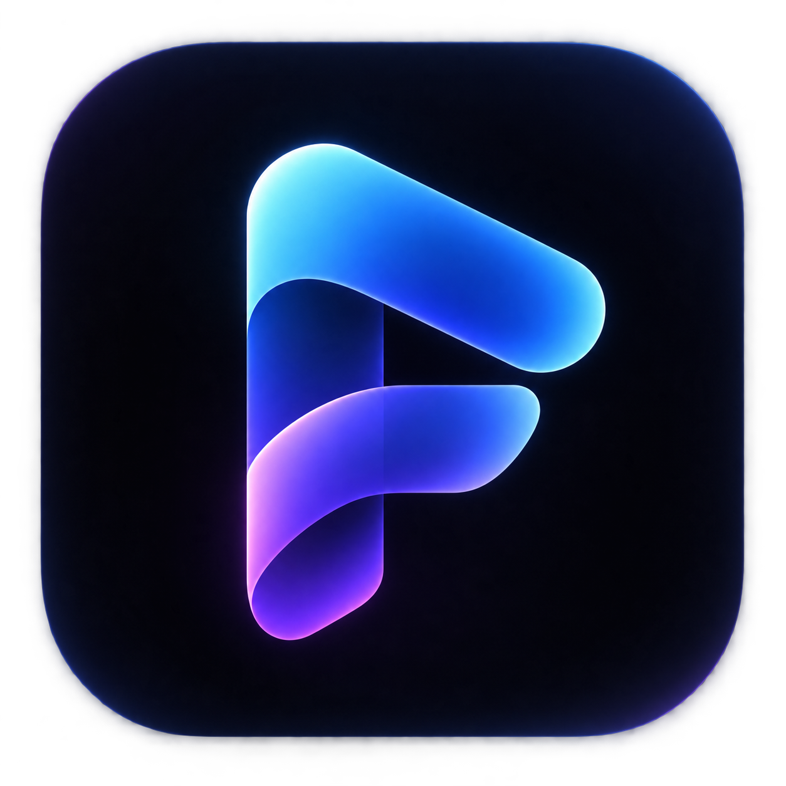

<div align="center">

  

  <h3>A modern, open-source media app for discovering and watching movies and TV shows.</h3>

  <p>
    Built with <strong>Kotlin Multiplatform</strong> and <strong>Compose Multiplatform</strong>.<br />
    Flixio organizes your favorite content, watch history, and subtitles into a cohesive, beautifully crafted interface.
  </p>

  <p>
    <a href="https://github.com/VivxKumar07/Flixio/releases">
      
    </a>
    <a href="./LICENSE">
      
    </a>
    <a href="https://kotlinlang.org/">
      
    </a>
    <a href="https://www.jetbrains.com/lp/compose-multiplatform/">
      
    </a>
    <a href="https://developer.android.com/">
      
    </a>
  </p>

  <p>
    <a href="#about">About</a> •
    <a href="#features">Features</a> •
    <a href="#flixio-modifications">Flixio Modifications</a> •
    <a href="#upstream-attribution">Upstream Attribution</a> •
    <a href="#getting-started">Getting Started</a> •
    <a href="#building-from-source">Building from Source</a> •
    <a href="#contributing">Contributing</a> •
    <a href="#license">License</a>
  </p>

</div>

---

## About

**Flixio** is an open-source media application designed for discovering, organizing, and streaming movies and TV shows across your devices. Built on modern multiplatform technologies, Flixio features a fluid, glassmorphic UI, robust multi-profile support, an extensible addon ecosystem, and an advanced dual-engine media player.

Flixio is built upon and modified from the open-source **Nuvio Mobile** project, introducing a distinct visual identity, tailored UI flows, gesture refinements, expanded subtitle customization, and improved profile synchronization.

> [!NOTE]
> **Flixio does not host, distribute, or stream any media content.** Flixio is a player frontend and catalog organizer that relies exclusively on user-configured addons, metadata providers, and streaming sources.

---

## Features

### 🎬 Home & Discovery
- **Personalized Header**: Dynamic time-based greeting (*"Good morning"*, *"Good afternoon"*, *"Good evening"*) paired with the active profile name in Clash Display typography.
- **Hero Carousel**: Highlighting featured titles with quick access to detailed media pages and watchlist management.
- **OTT Platforms Browser**: Dedicated quick-access carousel for exploring popular streaming platforms (Netflix, Disney+, Prime Video, Max, Apple TV+, and more).
- **Curated Catalog Rows**: Responsive horizontal carousels with deduplicated previews and instant poster rendering.
- **Continue Watching**: Automatically tracks your playback position across episodes and movies with resume prompts.

### 🔍 Search & Explore
- **Instant Search**: Fast, responsive title search with query history and catalog filtering.
- **Category Discover Grid**: 8 visually rich discover tiles in a 2-column layout to explore genres and themes.

### ⚡ Advanced Playback Engine
- **Dual Engine Architecture**: Supports both **AndroidX Media3 (ExoPlayer)** and **MPV (`libmpv`)** for broad audio/video codec compatibility.
- **Intuitive Gestures**:
  - **Left Vertical Swipe**: Volume control with boost capability up to **150%** (includes guidance notifications when exceeding 100%).
  - **Right Vertical Swipe**: Brightness adjustment.
  - **Horizontal Swipe**: Smooth seek scrubbing across the timeline.
- **Glassmorphic Gesture Overlays**: Frosted pill indicators displaying dynamic volume/brightness levels and mute states.
- **Flexible Playback Rates**: Speed controls ranging from `0.25x` to `3.0x`.
- **Binge Watching Features**: Next episode auto-play, episode drawer, and intro/outro segment skipping via IntroDB.
- **Picture-in-Picture (PiP)**: Seamless background playback on supported Android devices.

### 📝 Subtitles & Custom Font Importer
- **Format Support**: Embedded and external subtitles (SRT, VTT, and styled ASS/SSA powered by `libass-android`).
- **Comprehensive Styling**: Adjust font size, text color, background opacity, outline width, and vertical position.
- **Preset Font Families**: Normal, Bold, Heavy, Extra Bold, Serif, and Flixio Original.
- **Custom Font Importer**: Import your own `.ttf` or `.otf` font files directly from device storage into the player.
- **Timing & Audio Delay**: On-the-fly subtitle offset and audio synchronization controls.

### 👤 Profiles & Custom Avatars
- **Multi-Profile Support**: Independent watch history, continue watching lists, and library collections per profile.
- **745+ Bundled Avatars**: Extensive collection of categorized avatar icons bundled directly within the app.
- **Zero-Profile Onboarding**: Direct navigation to create your first profile on fresh installs.
- **Cloud & Local Sync**: Supabase-powered profile syncing across devices with resilient offline caching.

### 🔌 Addons & Debrid Integrations
- **Stremio Addon Protocol**: Full compatibility with Stremio v3 manifests for catalogs, streams, and subtitle sources.
- **Pre-Configured Addons**: Bundled support for Cinemeta (catalog & metadata) and OpenSubtitles v3.
- **Plugin Runtime**: Includes CloudStream plugin runtime support in full distribution builds.
- **Debrid Provider Integration**: Native integration with Real-Debrid, Premiumize, Torbox, AllDebrid, and Debrid-Link for fast stream resolution.

### 📊 Tracking & Scrobbling
- **Trakt & Simkl Integration**: Two-way synchronization for watch history, ratings, and episode scrobbling.
- **Graceful Error Handling**: Safe fallback handling when external API credentials are not configured.

---

## Flixio Modifications

Flixio is a substantially modified fork of Nuvio Mobile. Key changes and improvements include:

| Area | Changes in Flixio |
|---|---|
| **Identity & Branding** | Complete rebrand to Flixio, application ID set to `com.flixio.app`, deep linking scheme configured to `flixio://`, and updated vector/PNG branding assets. |
| **Home Experience** | Added dynamic time-aware greeting header, enhanced Clash Display typography, ambient theme glow, and ensured Hero action buttons route strictly to media details. |
| **Search Experience** | Restructured discovery section into an 8-card, 2-column layout with cinematic visual tiles. |
| **Player Gestures** | Realigned gesture sides (Left = Volume, Right = Brightness), added volume boost up to 150% with guidance toast, and refined frosted overlay indicators. |
| **Subtitle Engine** | Added font family options (Normal, Bold, Heavy, Extra Bold, Serif, Flixio Original) and built a custom TTF/OTF font importer for Android. |
| **Profiles & Avatars** | Integrated 745+ bundled avatar icons with clean numeric labels, hardened profile synchronization, and added direct zero-profile creation routing. |
| **Codebase Cleanup** | Removed obsolete scripts, unused templates, and stale artifacts while keeping core multiplatform architecture clean and maintainable. |

---

## Upstream Attribution

Flixio is built upon the open-source **Nuvio Mobile** project:
- **Upstream Repository**: [https://github.com/NuvioMedia/NuvioMobile](https://github.com/NuvioMedia/NuvioMobile)
- **Official Website**: [https://nuvio.tv/](https://nuvio.tv/)

We express our gratitude to the Nuvio Mobile authors and contributors for creating a capable multiplatform media client. Flixio continues to honor all applicable copyright notices, license conditions, and third-party terms from the original project.

---

## Supported Platforms

- **Android (Active Target)**: Fully supported for Android phones and tablets running **Android 7.0 (API 24)** or newer. Tested on modern Android versions (up to API 35).
- **iOS**: Upstream iOS project source sets and Xcode project (`iosApp/`) remain present in the repository from Nuvio Mobile; active maintenance and build verifications in this branch are currently focused on Android.

---

## Getting Started

### Downloading Flixio
Flixio is currently under active development. Pre-built APK releases will be published on the [GitHub Releases](https://github.com/VivxKumar07/Flixio/releases) page.

1. Download the latest `androidApp-full-debug.apk` or `androidApp-full-release.apk` from [Releases](https://github.com/VivxKumar07/Flixio/releases).
2. Install the APK on your Android device (ensure installation from unknown sources is permitted in settings).
3. Open Flixio, create a profile, and configure your preferred addons or integrations.

---

## Building from Source

### Prerequisites
- **JDK**: Java Development Kit 17 (or newer).
- **Android SDK**: Android SDK with API level 35 and Build Tools installed.
- **Android Studio**: Ladybug / Meerkat or command-line Gradle.

### 1. Clone the Repository
```bash
git clone https://github.com/VivxKumar07/Flixio.git
cd Flixio
git checkout cmp-rewrite
```

### 2. Configure Environment (Optional)
If you are connecting your own Supabase instance or API keys, create a `local.properties` file in the project root:
```properties
# Supabase Configuration
NUVIO_SUPABASE_URL=https://your-project.supabase.co
NUVIO_SUPABASE_ANON_KEY=your_long_supabase_anon_key

# Distribution
NUVIO_ANDROID_DISTRIBUTION=full
```

### 3. Build Android APK
Run the Gradle wrapper to build the full debug APK:

```bash
# On Linux / macOS:
./gradlew :androidApp:assembleFullDebug "-Pnuvio.android.distribution=full" --no-configuration-cache

# On Windows (PowerShell):
.\gradlew :androidApp:assembleFullDebug "-Pnuvio.android.distribution=full" --no-configuration-cache
```

The compiled APK will be generated at:
```
androidApp/build/outputs/apk/full/debug/androidApp-full-debug.apk
```

---

## Tech Stack & Architecture

- **Core**: [Kotlin Multiplatform](https://kotlinlang.org/docs/multiplatform.html)
- **UI Framework**: [Compose Multiplatform](https://www.jetbrains.com/lp/compose-multiplatform/) (Material 3)
- **Blur & Glassmorphism**: [Haze](https://github.com/chrisbanes/haze)
- **Image Loading**: [Coil 3](https://coil-kt.github.io/coil/)
- **Media Playback**: [AndroidX Media3 (ExoPlayer)](https://developer.android.com/media/media3) & [MPV Android Lib](https://github.com/mpv-android/mpv-android)
- **Subtitles**: [libass-android](https://github.com/peerless2012/ass-media)
- **Networking**: [Ktor Client](https://ktor.io/) & [OkHttp](https://square.github.io/okhttp/)
- **Backend & Auth**: [Supabase Kotlin](https://github.com/supabase-community/supabase-kt)
- **Diagnostics**: [Sentry Android](https://sentry.io/)

---

## Contributing

Contributions, feedback, and bug reports are welcome!

- **Found a bug?** Open an issue on our [Issue Tracker](https://github.com/VivxKumar07/Flixio/issues).
- **Have an idea?** Submit a [Feature Request](https://github.com/VivxKumar07/Flixio/issues/new?template=feature_request.yml).
- **Want to contribute code?** Please read our [Contributing Guide](./CONTRIBUTING.md) before opening a pull request.

---

## Maintainer

**Flixio** is maintained by:

- **Vivek Kumar** — [@VivxKumar07](https://github.com/VivxKumar07)

---

## Disclaimer

Flixio is an open-source media player and catalog aggregator.
- It does **not** provide, host, transmit, or control any media files or streams.
- It relies entirely on third-party metadata APIs, community-developed addons, and user-provided sources.
- Users are solely responsible for ensuring that their use of addons and content sources complies with local laws and regulations.

---

## License

This project is licensed under the **GNU General Public License v3.0** (GPLv3) — see the [LICENSE](./LICENSE) file for details.

Flixio incorporates code from [Nuvio Mobile](https://github.com/NuvioMedia/NuvioMobile) (licensed under GPLv3) and various open-source libraries. All third-party copyright notices and licenses are preserved and accessible within the application under **Settings → About → Licenses & Attributions**.
