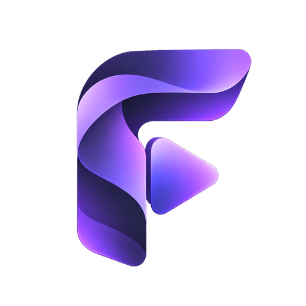

<div align="center">

  

  <h3>The Ultimate FOSS Streaming Hub & Media Discovery App</h3>
  <p><strong>One App. Every Addon. Zero Ads. Completely Open-Source.</strong></p>

  <p>
    Built with <strong>Kotlin Multiplatform</strong> & <strong>Compose Multiplatform</strong>.<br />
    Unifying <strong>Stremio Addons</strong>, <strong>CloudStream Providers</strong>, and <strong>Debrid Services</strong> into a breathtaking, fluid glassmorphic interface.
  </p>

  <p>
    <a href="https://github.com/VivxKumar07/Flixio/releases/latest">
      
    </a>
    <a href="https://github.com/VivxKumar07/Flixio/releases">
      
    </a>
    <a href="./LICENSE">
      
    </a>
    <a href="https://developer.android.com/">
      
    </a>
  </p>

  <p>
    <a href="#-features-at-a-glance">Features</a> •
    <a href="#-download--installation">Download</a> •
    <a href="#-why-flixio">Why Flixio?</a> •
    <a href="#-building-from-source">Build from Source</a> •
    <a href="#-attribution--license">Attribution & License</a>
  </p>

</div>

---

## About

**Flixio** is an open-source media application designed for discovering, organizing, and streaming movies and TV shows across your devices. Built on modern multiplatform technologies with **Kotlin Multiplatform** and **Compose Multiplatform**, Flixio features a fluid glassmorphic UI, robust multi-profile support, real-time cloud synchronization via Supabase, an extensible addon ecosystem, and an advanced dual-engine media player.

Flixio is built upon and modified from the open-source **Nuvio Mobile** project, introducing a distinct visual identity, tailored UI flows, gesture refinements, expanded subtitle customization, and improved profile synchronization.

> [!NOTE]
> **Flixio does not host, distribute, or stream any media content.** Flixio is a player frontend and catalog organizer that relies exclusively on user-configured addons, metadata providers, and streaming sources.

---

## 🌟 Why Flixio?

Most media apps make you choose between **Stremio's torrent/debrid addon ecosystem** or **CloudStream's direct-stream scrapers**. **Flixio brings both together** into a single, cohesive, modern application.

| Feature | Flixio | Stremio | CloudStream |
|:---|:---:|:---:|:---:|
| **Stremio v3 Addons** | ✅ Yes | ✅ Yes | ❌ No |
| **CloudStream .cs3 Providers** | ✅ Yes | ❌ No | ✅ Yes |
| **Debrid Integration** *(RD, AD, TorBox, etc.)* | ✅ Yes | ✅ Yes | ⚠️ Partial |
| **DNS-Over-HTTPS (DoH)** *(Bypass ISP Blocks)* | ✅ Built-in | ❌ No | ⚠️ Varies |
| **Dual Engine Player** *(Media3 ExoPlayer + libmpv)* | ✅ Yes | ❌ No | ❌ No |
| **Custom TTF/OTF Subtitle Font Importer** | ✅ Yes | ❌ No | ❌ No |
| **Volume Boost up to 150%** | ✅ Yes | ❌ No | ❌ No |
| **Two-way Cloud Sync** *(Supabase)* | ✅ Yes | ❌ No | ❌ No |
| **Trakt, Simkl & MDBList Scrobbling** | ✅ Yes | ⚠️ Trakt only | ⚠️ Trakt only |
| **745+ Built-in Profile Avatars** | ✅ Yes | ❌ No | ❌ No |
| **100% Free & Open Source (GPLv3)** | ✅ Yes | ⚠️ Partial | ✅ Yes |

---

## ✨ Features at a Glance

### 🔌 Ultimate Addon & Provider Ecosystem
- **CloudStream 3 Providers**: Native in-app support for `.cs3` plugins (MovieBox, SuperStream, XDMovies, Sflix, and all community provider repos) with automatic link extraction and resolver fallbacks.
- **Stremio Addon Protocol**: Full compatibility with Stremio v3 manifests for custom community catalogs, streams, and subtitle sources (Torrentio, MediaFusion, CyberFlix, Cinemeta, etc.).
- **DNS-over-HTTPS (DoH)**: Built-in encrypted DNS resolution allowing scrapers and streams to bypass ISP-level DNS filtering and blocks without requiring external VPNs.
- **Debrid Provider Integration**: Blazing fast, buffer-free playback with **Real-Debrid**, **Torbox**, **AllDebrid**, **Premiumize**, and **Debrid-Link**.

### ⚡ Advanced Dual-Engine Playback
- **Dual Engine Architecture**: Switch between **AndroidX Media3 (ExoPlayer)** and **MPV (`libmpv`)** for maximum hardware acceleration and universal audio/video codec compatibility.
- **Intuitive Gestures**:
  - **Left Vertical Swipe**: Volume adjustment with boost up to **150%** (with safe guidance notifications).
  - **Right Vertical Swipe**: Instant brightness adjustment.
  - **Horizontal Swipe**: Smooth timeline scrubbing and precise seeking.
- **Glassmorphic Overlays**: Frosted pill HUD indicators displaying volume, brightness, and audio states.
- **Binge-Watching Tools**: Auto-play next episode, episode drawer selector, playback speeds (`0.25x` to `3.0x`), and Intro/Outro segment skipping via IntroDB.
- **Picture-in-Picture (PiP)**: Keep watching in a floating window while using other apps.

### 📝 Subtitles & Custom Font Importer
- **Format Support**: Embedded tracks and external subtitle files (SRT, VTT, and styled ASS/SSA powered by `libass`).
- **Comprehensive Customization**: Size, text color, background opacity, outline width, and vertical positioning.
- **Custom Font Importer**: Import your own `.ttf` or `.otf` fonts directly from storage for the exact subtitle typography you want.
- **Audio & Subtitle Offset Sync**: Adjust timing delays on-the-fly to fix out-of-sync audio or subtitles.

### 🎬 Discovery & Organization
- **Personalized Header**: Dynamic time-based greeting (*"Good morning"*, *"Good afternoon"*, *"Good evening"*) paired with your active profile.
- **Hero Carousel**: Highlighting featured trending titles with smooth backdrop crossfades.
- **OTT Platforms Browser**: Dedicated quick-access carousel for Netflix, Disney+, Prime Video, Max, Apple TV+, and more.
- **Continue Watching**: Instant resume prompts and progress tracking across all your devices.
- **Category Discover Grid**: 8 visually rich discovery tiles to explore genres and curated collections.

### ☁️ Cloud Sync, Profiles & Tracking
- **Supabase Cloud Sync**: Two-way cross-device synchronization for watch progress, history, and library lists.
- **Trakt, Simkl & MDBList**: Scrobble your watch history, view community ratings, and import custom lists.
- **Multi-Profile Support**: Separate watch histories and libraries with **745+ bundled avatar icons**.

---

## Flixio Modifications

Flixio is a substantially modified fork of Nuvio Mobile. Key changes and improvements include:

| Area | Changes in Flixio |
|---|---|
| **Identity & Branding** | Complete rebrand to Flixio, application ID set to `com.flixio.app`, deep linking scheme configured to `flixio://`, and updated vector/PNG branding assets. |
| **Home Experience** | Added dynamic time-aware greeting header, enhanced Clash Display typography, ambient theme glow, stabilized hero container height to eliminate poster jitter, and refined Detail routing. |
| **UI Aesthetics** | Floating bottom navigation bar with pure Gaussian blur, removed tinting, and high-contrast selected indicators for effortless navigation. |
| **Search Experience** | Restructured discovery section into an 8-card, 2-column layout with cinematic visual tiles. |
| **Player Gestures** | Realigned gesture sides (Left = Volume, Right = Brightness), added volume boost up to 150% with guidance toast, and refined frosted overlay indicators. |
| **Subtitle Engine** | Added font family options (Normal, Bold, Heavy, Extra Bold, Serif, Flixio Original) and built a custom TTF/OTF font importer for Android. |
| **Profiles & Avatars** | Integrated 745+ bundled avatar icons with clean numeric labels, hardened profile synchronization, and added direct zero-profile creation routing. |
| **Cloud Synchronization** | Implemented Supabase cloud synchronization for seamless cross-device watch history, progress tracking, and library lists. |
| **Tracking & Metadata** | Built-in native MDBList support for user lists and ratings alongside Trakt and Simkl. |
| **Integrations** | CloudStream addon playback support and Telegram media streaming groundwork (with QR and phone verification). |

---

## Upstream Attribution

Flixio is built upon the open-source **Nuvio Mobile** project:
- **Upstream Repository**: [https://github.com/NuvioMedia/NuvioMobile](https://github.com/NuvioMedia/NuvioMobile)
- **Official Website**: [https://nuvio.tv/](https://nuvio.tv/)

Flixio honors all applicable copyright notices, license conditions, and third-party terms from the original project.

---

## Supported Platforms

- **Android (Active Target)**: Fully supported for Android phones and tablets running **Android 7.0 (API 24)** or newer. Tested on modern Android versions (up to Android 15 / API 35).
- **iOS**: iOS project source sets and Xcode configuration (`iosApp/`) are maintained in the repository. Automated IPA packages can be built via the provided GitHub Actions workflow on macOS runners.

---

## 📥 Download & Installation

The latest optimized release builds are available on the [**GitHub Releases**](https://github.com/VivxKumar07/Flixio/releases) page.

| Architecture | Package Name | Size | Recommended For |
|:---|:---|:---:|:---|
| **ARM64-v8a** *(Recommended)* | `androidApp-full-arm64-v8a-release.apk` | **~89 MB** | **All modern Android phones & tablets** (Pixel, Samsung, OnePlus, Xiaomi, Nothing, etc.) |
| **Universal** | `androidApp-full-universal-release.apk` | **~193 MB** | Works on any Android device (all native libraries bundled) |
| **ARMv7a** | `androidApp-full-armeabi-v7a-release.apk` | **~87 MB** | Older 32-bit devices, cheap Android TV boxes & Firestick |
| **x86_64** | `androidApp-full-x86_64-release.apk` | **~91 MB** | Android Emulators, Chromebooks & Windows Subsystem for Android |

#### Quick Start:
1. Download **`androidApp-full-arm64-v8a-release.apk`** from [**Releases**](https://github.com/VivxKumar07/Flixio/releases).
2. Install the APK on your device *(allow "Install from Unknown Sources" if prompted)*.
3. Launch Flixio, create your profile, and install your preferred Stremio addons or CloudStream provider repositories under **Settings → Addons & Providers**!

---

## Building from Source

### Prerequisites
- **JDK**: Java Development Kit 17 (or newer).
- **Android SDK**: Android SDK with API level 35 and Build Tools installed.
- **Android Studio**: Ladybug / Meerkat or command-line Gradle.

### 1. Clone the Repository
```bash
git clone https://github.com/VivxKumar07/Flixio.git
cd Flixio
git checkout cmp-rewrite
```

### 2. Configure Environment (Optional)
If you are connecting your own Supabase instance or API keys, create a `local.properties` file in the project root:
```properties
# Supabase Configuration
FLIXIO_SUPABASE_URL=https://your-project.supabase.co
FLIXIO_SUPABASE_ANON_KEY=your_long_supabase_anon_key

# Distribution
FLIXIO_ANDROID_DISTRIBUTION=full
```

### 3. Build Android APK
Run the Gradle wrapper to build the full debug APK:

```bash
# On Linux / macOS:
./gradlew :androidApp:assembleFullDebug "-Pflixio.android.distribution=full" --no-configuration-cache

# On Windows (PowerShell):
.\gradlew :androidApp:assembleFullDebug "-Pflixio.android.distribution=full" --no-configuration-cache
```

The compiled APK will be generated at:
```
androidApp/build/outputs/apk/full/debug/androidApp-full-debug.apk
```

---

## Tech Stack & Architecture

- **Core**: [Kotlin Multiplatform](https://kotlinlang.org/docs/multiplatform.html)
- **UI Framework**: [Compose Multiplatform](https://www.jetbrains.com/lp/compose-multiplatform/) (Material 3)
- **Blur & Glassmorphism**: [Haze](https://github.com/chrisbanes/haze)
- **Image Loading**: [Coil 3](https://coil-kt.github.io/coil/)
- **Media Playback**: [AndroidX Media3 (ExoPlayer)](https://developer.android.com/media/media3) & [MPV Android Lib](https://github.com/mpv-android/mpv-android)
- **Subtitles**: [libass-android](https://github.com/peerless2012/ass-media)
- **Networking**: [Ktor Client](https://ktor.io/) & [OkHttp](https://square.github.io/okhttp/)
- **Backend & Auth**: [Supabase Kotlin](https://github.com/supabase-community/supabase-kt)
- **Diagnostics**: [Sentry Android](https://sentry.io/)

---

## Contributing

Contributions, feedback, and bug reports are welcome!

- **Found a bug?** Open an issue on our [Issue Tracker](https://github.com/VivxKumar07/Flixio/issues).
- **Have an idea?** Submit a [Feature Request](https://github.com/VivxKumar07/Flixio/issues/new?template=feature_request.yml).
- **Want to contribute code?** Please read our [Contributing Guide](./CONTRIBUTING.md) before opening a pull request.

---

## Maintainer

**Flixio** is maintained by:

- **Vivek Kumar** — [@VivxKumar07](https://github.com/VivxKumar07)

---

## Disclaimer

Flixio is an open-source media player and catalog aggregator.
- It does **not** provide, host, transmit, or control any media files or streams.
- It relies entirely on third-party metadata APIs, community-developed addons, and user-provided sources.
- Users are solely responsible for ensuring that their use of addons and content sources complies with local laws and regulations.

---

## License

This project is licensed under the **GNU General Public License v3.0** (GPLv3) — see the [LICENSE](./LICENSE) file for details.

Flixio incorporates code from [Nuvio Mobile](https://github.com/NuvioMedia/NuvioMobile) (licensed under GPLv3) and various open-source libraries. All third-party copyright notices and licenses are preserved and accessible within the application under **Settings → About → Licenses & Attributions**.
